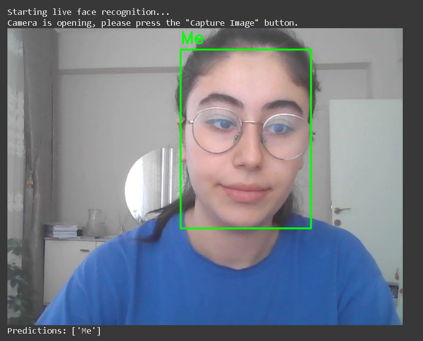
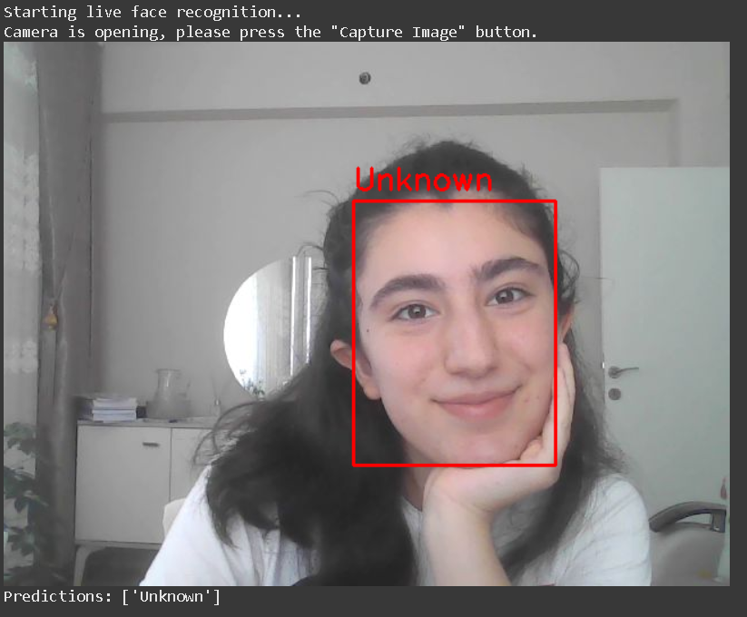
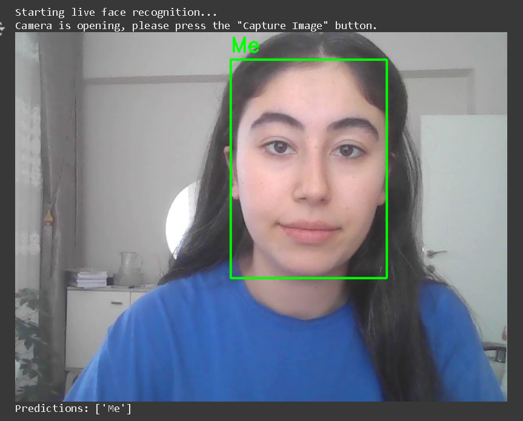

# Face Recognition System

This project aims to develop a simple face recognition system using **FaceNet** and a **KNN classifier**. The system can recognize a person's face and classify it as **"Me"** or **"Unknown"** from both dataset images and live webcam feeds.

## Project Structure

The project is organized with the following main steps:

### 1. Installing Dependencies
Install the required libraries such as `facenet-pytorch`, `mtcnn`, `scikit-learn`, `torch`, and others.

### 2. Mounting Google Drive
Connect Google Drive to store and access the dataset, embeddings, and trained model.

### 3. Setting up Project Folders
Prepare the necessary folders for:
- `dataset` (with `Me` and `Unknown` subfolders),
- `cropped_faces`,
- `embeddings`,
- `model`.

### 4. Face Cropping and Data Augmentation
Use **MTCNN** to detect and crop faces. Apply data augmentation to increase the diversity of training samples.

### 5. Generating Face Embeddings
Extract embeddings (128D vectors) from cropped faces using the **FaceNet** model.

### 6. Training and Evaluating KNN Classifier
Train a **KNN classifier** with the embeddings and evaluate its performance using:
- Accuracy score
- Confusion matrix
- Classification report

### 7. Live Face Recognition
Run the live test with a webcam to classify real-time faces as either **"Me"** or **"Unknown"**.

## Requirements

This project was primarily developed and tested in **Google Colab**, which comes with most dependencies pre-installed.  
For running locally, install the required dependencies using:

```bash
pip install -r requirements.txt
````

## Results

The trained model achieved **91.67% accuracy** with strong performance in distinguishing between "Me" and "Unknown".

```bash
Model accuracy: 91.67%
Confusion Matrix:
 [[44  2]
 [ 5 33]]

Classification Report:
               precision    recall  f1-score   support

          Me       0.90      0.96      0.93        46
     Unknown       0.94      0.87      0.90        38

    accuracy                           0.92        84
   macro avg       0.92      0.91      0.92        84
weighted avg       0.92      0.92      0.92        84
````

## Demo
| Demo 1 | Demo 2 | Demo 3 |
|--------|--------|--------|
|  |  |  |

## Contact

For any questions or feedback, feel free to reach out.


